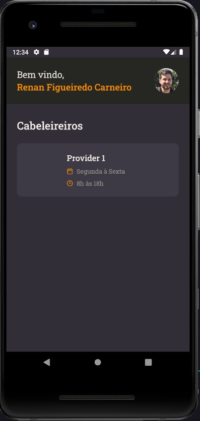

 
<h1>:scissors: GoBarber App :scissors:</h1>

## About this project

Mobile app used to make appointment with providers.

### Tecnologies

- Typescript
- React Native
- Styled Components

## Requirements

- [GoBarber API](https://github.com/rnanc/gobarber-api)
- Node
- Yarn

## Installing

Run the following command:

`$ yarn`

for Android:

`$ yarn android`

for Android Studio Emulator:

`$ adb revere tcp:3333 tcp:3333`

for IOS:

Run the command `$ pod install` inside `ios folder`

then run the following command:

`$ yarn ios`

## Related Links

GoBarber API :mailbox_closed:: https://github.com/rnanc/gobarber-api

GoBarber Web :computer:: https://github.com/rnanc/gobarber-web
